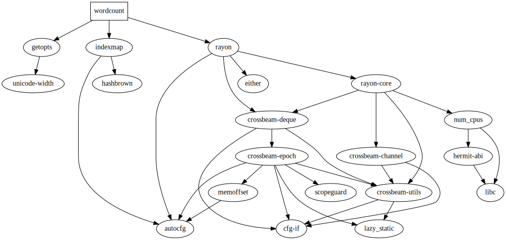

# Wordcount Coding Challenge 2019

- [Build](#build)
  - [Build with Docker](#build-with-docker)
- [Run](#run)
  - [Run with Docker](#run-with-docker)
- [Used libraries](#used-libraries)
  - [indexmap](#indexmap)
  - [jemallocator](#jemallocator)
  - [rayon](#rayon)
- [License](#license)

## Build

To build this project you need the latest version of [Rust][rust_install] (1.38.0 as of writing)
installed with clippy added as well. Then run:

```bash
cargo build --release
```

[rust_install]: https://www.rust-lang.org/tools/install

### Build with Docker

You can also build this project with Docker.

```bash
docker build -t wordcount .
```

## Run

The build output will be in the `target/release` folder. To run the program provide **words**
and **article** files and any further options as you like.

```bash
target/release/wordcount words.txt article.txt [options]
```

To see the available options run the program without any arguments or just the `-h/--help` flag.

```bash
$ target/release/wordcount
Usage: wordcount WORDS_FILE ARTICLE_FILE [options]

Options:
    -n, --naive         Use a naive custom implementation
    -f, --fourtytwo     Use the fastest algorithm in the world
    -h, --help          Print this help menu
    -v, --version       Show the program version
```

### Run with Docker

If you built the docker image you can run it as follows. It will automatically
run some benchmarks with `hyperfine` to give you an idea of the speed.

```bash
docker run -it --rm wordcount
```

## Used libraries

This is a list of all used external dependencies with a short explanation what each one does.



### indexmap

Indexmap is a **map** that acts the same way as a `HashMap` but preserves insertion order and allows
accessing elements by key as well as by index.

### jemallocator

An alternative memory allocator that is faster than the system default.

### rayon

Rayon is a parallelism library that simplifies the parallel execution of tasks. It allows to turn
typical iterators into parallel ones and automatically distributes following operations like `map`
and `filters` to a thread pool.

## License

This project is released under either the [MIT License](LICENSE-MIT) or the
[Apache-2.0 License](LICENSE-APACHE) at your option.

Contents under `src/aho_corasick` are based on the [aho-corasick Rust crate][aho_corasick_github],
which is released under the [Unlicense](src/aho_corasick/UNLICENSE).

[aho_corasick_github]: https://github.com/BurntSushi/aho-corasick
